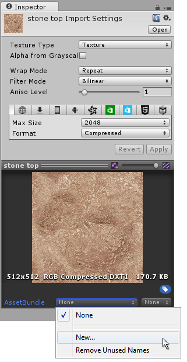

# 热更新教程
从目前的调研看，使用Lua开发所有的逻辑并没有太大的必要，因为U3D绑定Lua代码还是需要在对象上绑定C#脚本，再在脚本里载入Lua脚本。由于我目前对U3D的了解并不深，如U3D资源加载的机制，动态创建对象场景等，所以如果后续有更好的方式能够热更新所有的逻辑，我们会转向更好的方式。

当前研究的方式为使用AssetBundles下载资源包，并在资源包中使用Xlua做Hotfix，不涉及使用Lua开发完整的功能。

## AssetBundles
### 创建AssetBundle
从Project窗口选择某个资源之后，在右边Insector的最下边可以看到AssetBundle菜单，点击列表可以看到当前已经有的AssetBundle，或者创建新的。



选择需要添加到AssetBundle的资源，在AssetBundle菜单中选择合适的AssetBundle即可。

### 打包AssetBundle
在Editor目录新增脚本文件CreateAssetBundles.cs, 拷贝如下代码
```
using UnityEditor;

public class CreateAssetBundles
{
    [MenuItem("Assets/Build AssetBundles")]
    static void BuildAllAssetBundles()
    {
        BuildPipeline.BuildAssetBundles("Assets/AssetBundles", BuildAssetBundleOptions.None, BuildTarget.StandaloneOSXUniversal);
    }
}
```
在Unity菜单栏Assets菜单下会新增Build AssetBundles菜单，点击即可以打包AssetBundles。打包后的资源会生成在项目Assets/AssetBundles目录下，该目录需要预先创建好。

### 下载AssetBundle和载入Objects

推荐使用WWW.LoadFromCacheOrDownload从网络上下载资源包，参考代码如下：
```
public class ScriptLoader : MonoBehaviour {

    static LuaEnv luaEnv = new LuaEnv();
    public string bundleUrl;
    public string assetName;

    void Start()
    {
        StartCoroutine(DownloadAndCache());
    }

    IEnumerator DownloadAndCache()
    {
#if UNITY_EDITOR
        TextAsset txt = UnityEditor.AssetDatabase.LoadAssetAtPath("Assets/Resources/HotFixTest.lua.txt", typeof(TextAsset)) as TextAsset;
        luaEnv.DoString(txt.text);
        yield return null;

#else
        // Wait for the Caching system to be ready
        while (!Caching.ready)
            yield return null;

        // Load the AssetBundle file from Cache if it exists with the same version or download and store it in the cache
        //using (WWW www = new WWW(bundleUrl))
        using (WWW www = WWW.LoadFromCacheOrDownload(bundleUrl, 4))
        {
            yield return www;
            if (www.error != null)
                throw new Exception("WWW download had an error:" + www.error);
            AssetBundle bundle = www.assetBundle;
            if (assetName == "")
                Instantiate(bundle.mainAsset);
            else
                Instantiate(bundle.LoadAsset(assetName));

            TextAsset txt = bundle.LoadAsset("HotFixTest.lua", typeof(TextAsset)) as TextAsset;
            luaEnv.DoString(txt.text);

            // Unload the AssetBundles compressed contents to conserve memory
            bundle.Unload(false);

        } // memory is freed from the web stream (www.Dispose() gets called implicitly)
#endif
    }
    // Update is called once per frame
    void Update () {

	}
}
```

bundleUrl为打包后的AssetBundle的下载地址，LoadFromCacheOrDownload会先检查AssetBundle是否已经下载，如果已经下载完成则直接从本地加载。第二个参数用来指定资源包的版本，若当前代码中的版本比Cache中存的版本高，则会下载新的。所以线上环境可以放一个文件存储当前最新的版本号，下载前从网络获取最新版本号再下载。

下载完成后，可以使用Instantiate创建Object，assetName指定为打包的资源的名字，例如Prefab名字等。也可以使用LoadAsset载入资源。

在开发过程中，为了防止每次更新资源都需要重新打包AssetBundle并且上传到服务器，可以使用UNITY_EDITOR，在开发过程中直接从本地加载。

## XLua

### XLua下载以及配置

从https://github.com/Tencent/Xlua 下载最新版Xlua。解压缩后将Assets文件夹下内容拷贝到自己工程的Assets目录中，将Tools拷贝到自己工程Assets同级目录中。

### IDE配置

* 打开HOTFIX_ENABLE宏，打开方法为点击 File->BuildSetting, 选择Player，点击Player Setting，在右边Inspector窗口的Scripting Define Symbols* 输入框中输入 HOTFIX_ENABLE
* 执行XLua/Generate Code菜单
* 在编辑器模式执行XLua/Hotfix Inject In Editor。 在打包手机模式不需要手动执行，会自动执行。

### 约束

* 不支持静态构造函数。
* 不支持在子类override函数通过base调用父类实现。
* 目前只支持Assets下代码的热补丁，不支持引擎，c#系统库的热补丁。

### API

xlua.hotfix(class, [method_name], fix)

* 描述 ： 注入lua补丁
* class ： C#类，两种表示方法，CS.Namespace.TypeName或者字符串方式"Namespace.TypeName"，字符串格式和C#的Type.GetType要求一致，如果是内嵌类型（Nested Type）是非Public类型的话，只能用字符串方式表示"Namespace.TypeName+NestedTypeName"；
* method_name ： 方法名，可选；
* fix ： 如果传了method_name，fix将会是一个function，否则通过table提供一组函数。table的组织按key是method_name，value是function的方式。

xlua.private_accessible(class)

* 描述 ： 让一个类的私有字段，属性，方法等可用
* class ： 同xlua.hotfix的class参数

### 标识要更新的类信息

可以直接在类上方加上热更新标签。
```
using UnityEngine;
using System.Collections;
using XLua;

[Hotfix(HotfixFlag.Stateless)] //Hotfix标识
public class Quit : MonoBehaviour {

	void Update () {
        if(isTouched()) {
            testHotfix();
        }
	}

    public bool isTouched() {
        bool result = false;
        if(Input.touchCount == 1) {
            if(Input.touches[0].phase == TouchPhase.Ended) {
                Vector3 wp = Camera.main.ScreenToWorldPoint(Input.GetTouch(0).position);
                Vector2 touchPos = new Vector2(wp.x, wp.y);
                if (GetComponent<Collider2D>() == Physics2D.OverlapPoint(touchPos)) {
                    result = true;
                }
            }
        }
        if(Input.GetMouseButtonUp(0)) {
            Vector3 wp = Camera.main.ScreenToWorldPoint(Input.mousePosition);
            Vector2 mousePos = new Vector2(wp.x, wp.y);
            if (GetComponent<Collider2D>() == Physics2D.OverlapPoint(mousePos)) {
                result = true;
            }
        }
        return result;
    }

    public void testHotfix()
    {
        Debug.Log("Raw  hotfix value");
    }

}
```

或者在一个static类的static字段或者属性里头配置一个列表。属性可以用于实现的比较复杂的配置，比如根据Namespace做白名单。
```
public static class HotfixCfg
{
    [Hotfix]
    public static List<Type> by_field = new List<Type>()
    {
        typeof(HotFixSubClass),
        typeof(GenericClass<>),
    };

    [Hotfix]
    public static List<Type> by_property
    {
        get
        {
            return (from type in Assembly.Load("Assembly-CSharp").GetTypes()
                    where type.Namespace == "XXXX"
                    select type).ToList();
        }
    }
}
```

HotFix后可以加一个标志，HotfixFlag.Stateless或者HotfixFlag.Stateful, 如果不加默认为Stateless模式。<span style="color:red">在Stateless模式下，C#对象直接作为hotfix函数的self参数，即第一个参数。在Stateful模式下，可以在hotfix的构造函数中返回一个table，其他的hotfix函数的self参数为构造函数返回的table；如果未在lua中定义构造函数，则self为nil。</span>

### 实例

上述的Quit.cs,对应的hotfix代码如下:
```
--[[     
-- 第一种hotfix方式
xlua.hotfix(CS.Quit, 'testHotfix',  function(self)
        print('Lua hotfix value')
    end
)
--]]

-- 第二种hotfix方式，一次替换整个类

xlua.hotfix(CS.Quit, {
    Update = function(self)
        if (self:isTouched(self)) then
            self:testHotfix()
            --CS.UnityEngine.Application.LoadLevel("level_1");
        end
    end;

    testHotfix = function(self)
        print('Lua hotfix value 2')
    end
})

```

可以在Scene中创建一个空Object，在这个空对象上绑定一个C#脚本，再在脚本里面从网络上下载最新hotfix assetbundle，如上ScriptLoader.cs的例子。

## 参考资料

* AssetBundles资料参考 https://docs.unity3d.com/Manual/AssetBundlesIntro.html
* Xlua资料参考 https://github.com/Tencent/Xlua
* Xlua Hotfix资料参考 https://github.com/Tencent/xLua/blob/master/Assets/XLua/Doc/hotfix.md
* 游戏源码来源 https://github.com/nraboy/unity3d-floppy-clone-game.git
